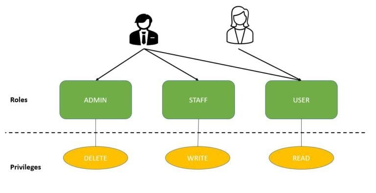
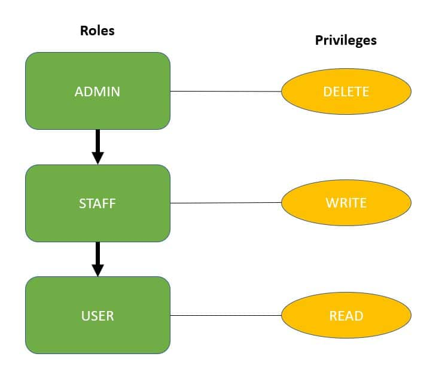

# [Spring 安全 - 角色和权限](https://www.baeldung.com/role-and-privilege-for-spring-security-registration)

1. 概述

    本教程将继续 Spring Security 注册系列，介绍如何正确实施角色和权限。

2. 用户、角色和权限

    让我们从实体开始。我们有三个主要实体：

    - 用户
    - 角色代表用户在系统中的高级角色。每个角色都有一组低级权限。
    - 权限代表系统中较低级别的权限。

    下面是用户：

    ```java
    @Entity
    public class User {
    
        @Id
        @GeneratedValue(strategy = GenerationType.AUTO)
        private Long id;

        private String firstName;
        private String lastName;
        private String email;
        private String password;
        private boolean enabled;
        private boolean tokenExpired;

        @ManyToMany 
        @JoinTable( 
            name = "users_roles", 
            joinColumns = @JoinColumn(
            name = "user_id", referencedColumnName = "id"), 
            inverseJoinColumns = @JoinColumn(
            name = "role_id", referencedColumnName = "id")) 
        private Collection<Role> roles;
    }
    ```

    正如我们所看到的，用户包含了角色以及正确注册机制所需的其他一些细节。

    接下来是角色：

    ```java
    @Entity
    public class Role {
    
        @Id
        @GeneratedValue(strategy = GenerationType.AUTO)
        private Long id;

        private String name;
        @ManyToMany(mappedBy = "roles")
        private Collection<User> users;

        @ManyToMany
        @JoinTable(
            name = "roles_privileges", 
            joinColumns = @JoinColumn(
            name = "role_id", referencedColumnName = "id"), 
            inverseJoinColumns = @JoinColumn(
            name = "privilege_id", referencedColumnName = "id"))
        private Collection<Privilege> privileges;
    }
    ```

    最后，让我们来看看特权：

    ```java
    @Entity
    public class Privilege {
    
        @Id
        @GeneratedValue(strategy = GenerationType.AUTO)
        private Long id;

        private String name;

        @ManyToMany(mappedBy = "privileges")
        private Collection<Role> roles;
    }
    ```

    正如我们所见，我们将 用户 <-> 角色和角色 <-> 权限 关系都视为多对多双向关系。

3. 设置权限和角色

    接下来，让我们集中精力对系统中的权限和角色进行一些早期设置。

    我们将把它与应用程序的启动联系起来，并在 ContextRefreshedEvent 上使用 ApplicationListener 在服务器启动时加载初始数据：

    

    那么，在这段简单的设置代码中发生了什么？没什么复杂的：

    - 我们正在创建权限。
    - 然后创建角色并为其分配权限。
    - 最后，我们创建一个用户并为其分配一个角色。

    请注意我们是如何使用 alreadySetup 标志来确定是否需要运行设置的。这是因为 ContextRefreshedEvent 可能会被触发多次，这取决于我们在应用程序中配置了多少个上下文。而我们只想运行一次设置。

    这里有两点简要说明。我们首先来看术语。我们在这里使用的是 "权限"-"角色" (Privilege – Role)术语。但在 Spring 中，这些术语略有不同。在 Spring 中，我们的特权(Privilege)被称为 "角色"（Role）和 "授权"（granted），这有点令人困惑。

    当然，这对实现来说不是问题，但绝对值得注意。

    其次，这些 Spring Role（我们的权限）需要一个前缀。默认情况下，前缀是 "ROLE"，但也可以更改。我们在此不使用该前缀，只是为了保持简单，但请记住，如果我们不明确更改，则需要使用该前缀。

4. 自定义用户详情服务

    现在我们来看看身份验证过程。

    我们将看到如何在自定义 UserDetailsService 中检索用户，以及如何根据用户分配的角色和权限映射正确的权限集：

    

    这里值得关注的是特权（和角色）是如何映射到授予的权限实体的。

    这种映射使整个安全配置高度灵活、功能强大。我们可以根据需要对角色和权限进行精细的混合和匹配，最后将它们正确地映射到授权并返回给框架。

5. 角色层次结构

    此外，让我们将角色组织成层次结构。

    我们已经了解了如何通过将权限映射到角色来实现基于角色的访问控制。这样，我们就可以为用户分配一个角色，而不必分配所有单独的权限。

    然而，随着角色数量的增加，用户可能需要多个角色，从而导致角色爆炸：

    

    为了解决这个问题，我们可以使用 Spring Security 的角色分层：

    

    分配角色 "ADMIN" 会自动赋予用户 "STAFF" 和 "USER" 两种角色的权限。

    但是，拥有 STAFF 角色的用户只能执行 STAFF 和 USER 角色的操作。

    让我们在 Spring Security 中创建这个层次结构，只需公开一个 RoleHierarchy 类型的 Bean 即可：

    ```java
    @Bean
    public RoleHierarchy roleHierarchy() {
        RoleHierarchyImpl roleHierarchy = new RoleHierarchyImpl();
        String hierarchy = "ROLE_ADMIN > ROLE_STAFF \n ROLE_STAFF > ROLE_USER";
        roleHierarchy.setHierarchy(hierarchy);
        return roleHierarchy;
    }
    ```

    我们在表达式中使用 > 符号来定义角色层次结构。在这里，我们将角色 ADMIN 配置为包含角色 STAFF，而 STAFF 又包含角色 USER。

    为了在 Spring Web 表达式中包含此角色层次结构，我们将 roleHierarchy 实例添加到 WebSecurityExpressionHandler 中：

    ```java
    @Bean
    public DefaultWebSecurityExpressionHandler customWebSecurityExpressionHandler() {
        DefaultWebSecurityExpressionHandler expressionHandler = new DefaultWebSecurityExpressionHandler();
        expressionHandler.setRoleHierarchy(roleHierarchy());
        return expressionHandler;
    }
    ```

    最后，将 expressionHandler 添加到 http.authorizeRequests() 中：

    ```java
    @Bean
        public SecurityFilterChain filterChain(HttpSecurity http) throws Exception {
            http.csrf()
                .disable()
                .authorizeRequests()
                    .expressionHandler(webSecurityExpressionHandler())
                    .antMatchers(HttpMethod.GET, "/roleHierarchy")
                    .hasRole("STAFF")
        ...
    }
    ```

    端点 /roleHierarchy 受 ROLE_STAFF 保护，以证明 webSecurityExpressionHandler 正在工作。

    正如我们所见，角色分层是减少我们需要为用户添加的角色和权限数量的好方法。

6. 用户注册

    最后，让我们来看看新用户的注册。

    我们已经了解了如何创建用户并为其分配角色（和权限）。

    现在让我们看看在注册新用户时需要如何完成这些工作：

    ```java
    @Override
    public User registerNewUserAccount(UserDto accountDto) throws EmailExistsException {
    
        if (emailExist(accountDto.getEmail())) {
            throw new EmailExistsException
            ("There is an account with that email adress: " + accountDto.getEmail());
        }
        User user = new User();

        user.setFirstName(accountDto.getFirstName());
        user.setLastName(accountDto.getLastName());
        user.setPassword(passwordEncoder.encode(accountDto.getPassword()));
        user.setEmail(accountDto.getEmail());

        user.setRoles(Arrays.asList(roleRepository.findByName("ROLE_USER")));
        return repository.save(user);
    }
    ```

    在这个简单的实现中，由于我们假定注册的是一个标准用户，因此为其分配了 ROLE_USER 角色。

    当然，通过使用多个硬编码注册方法或允许客户端发送注册用户的类型，可以用同样的方法轻松实现更复杂的逻辑。

7. 结论

    在本文中，我们介绍了如何使用 JPA 为 Spring Security 支持的系统实现角色和权限。

    我们还配置了角色层次结构，以简化访问控制配置。
